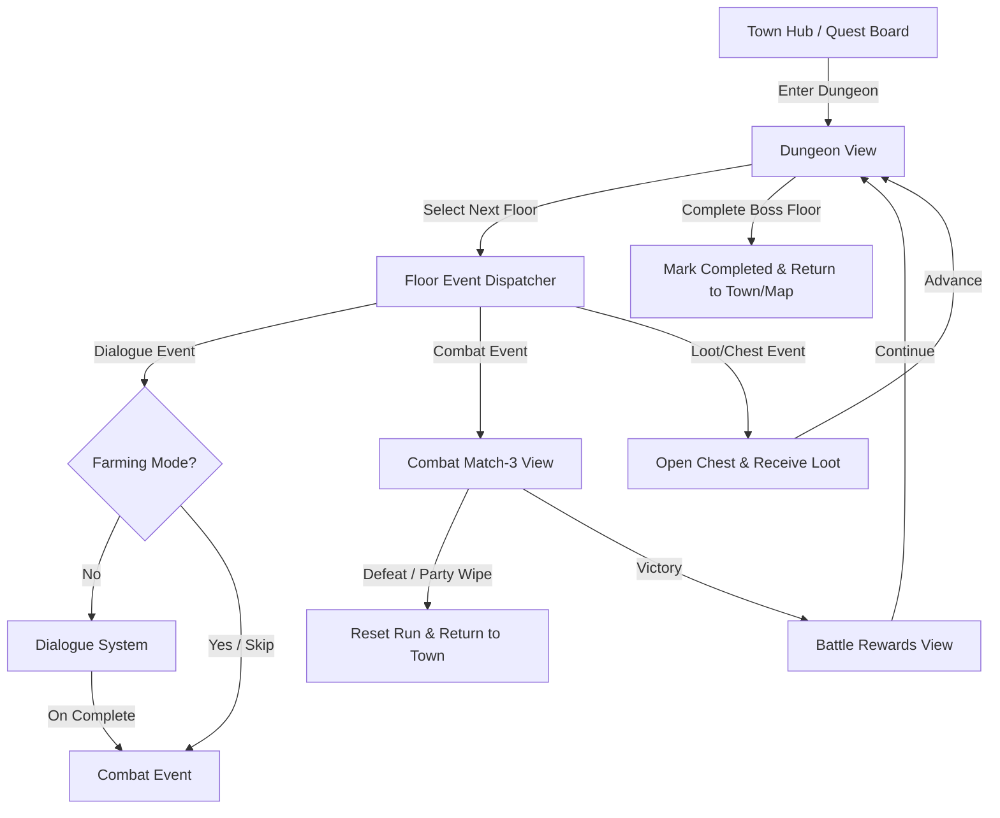

# Linear Dungeon System Design & Integration Plan

This document outlines the design and integration plan for implementing a linear, UI-based Dungeon System in the project. It describes how the feature will integrate with the existing systems (routing, party, combat, dialogue, and loot) and how we can implement it without relying on a grid-based map or character traversal.

---

## 1. System Overview & Architecture

The Dungeon System is designed to be fully deterministic, driven by JSON constants, and structured as a linear sequence of floors. There is **no grid-based map traversal or walking avatar**. Instead, the player manages their dungeon run through a dedicated, premium PC UI screen displaying:
- A vertical track of nodes representing floors (Floor 1 $\rightarrow$ Floor 2 $\rightarrow$ ... $\rightarrow$ Boss).
- A central view area showing the floor theme illustration and current floor events.

### High-Level Event Flow



---

## 2. TypeScript Data Structures

Following the conventions defined in [CLAUDE.md](file:///C:/Github/fantasy-puzzle-rpg/CLAUDE.md), we avoid TypeScript enums in favor of literal union types and maps, and use descriptive interfaces for all configurations. 

These types will be defined in a new file, `src/types/dungeon.ts`:

```typescript
// src/types/dungeon.ts

/**
 * Valid event types that can occur on a dungeon floor
 */
export type DungeonEventType = 'dialogue' | 'combat' | 'loot' | 'chest';

/**
 * A single event inside a dungeon floor sequence
 */
export interface DungeonEvent {
  /** Unique ID for the event block */
  id: string;
  /** Type of event determining the dispatcher destination */
  type: DungeonEventType;
  /** Dialogue scene identifier (used if type is 'dialogue') */
  dialogueSceneId?: string;
  /** Enemy ID to spawn (used if type is 'combat') */
  enemyId?: string;
  /** Loot table identifier (used if type is 'loot' or 'chest') */
  lootTableId?: string;
}

/**
 * Configuration for an individual floor in a dungeon
 */
export interface DungeonFloor {
  /** 1-based floor number */
  floorNumber: number;
  /** Display name of the floor */
  name: string;
  /** Optional brief description/flavor text of the floor */
  description?: string;
  /** Optional background image override for this specific floor */
  bgImage?: string;
  /** Sequenced list of events that occur on this floor */
  events: DungeonEvent[];
}

/**
 * Core definition structure for a Dungeon
 */
export interface DungeonDefinition {
  /** Unique identifier for the dungeon */
  id: string;
  /** Display name of the dungeon */
  name: string;
  /** Description/flavor text shown before entering */
  description: string;
  /** Default background image path for the entire dungeon */
  bgImage: string;
  /** Linear list of floors making up the dungeon */
  floors: DungeonFloor[];
}
```

---

## 3. Store and Routing Integration

The dungeon system will fit directly into our existing view-routing and Zustand architecture.

### Routing Configuration
We will introduce a new `'dungeon'` view and define its route parameters inside [routing.ts](file:///C:/Github/fantasy-puzzle-rpg/src/types/routing.ts).

- Add `'dungeon'` to the `ViewType` union.
- Define `DungeonViewData` in [routing.ts](file:///C:/Github/fantasy-puzzle-rpg/src/types/routing.ts):
  ```typescript
  export interface DungeonViewData {
    dungeonId: string;
  }
  ```
- Implement `goToDungeon` in the router actions slice [router.ts](file:///C:/Github/fantasy-puzzle-rpg/src/stores/slices/router.ts) to transition the player.

### Dungeon Run Store Slice
To track runtime state, we can create a `DungeonRunSlice` in our Zustand store (`src/stores/slices/dungeon-run.ts` and `src/stores/slices/dungeon-run.types.ts`). This keeps the dungeon progression persistent and makes it easy to resume a run if the player closes the window.

```typescript
// src/stores/slices/dungeon-run.types.ts
import type { BaseSlice } from '../../types/store';

export interface DungeonRunState {
  activeDungeonId: string | null;
  currentFloorIndex: number;
  currentEventIndex: number;
  completedDungeons: Record<string, boolean>; // tracks completion for farming mode
}

export interface DungeonRunActions {
  startDungeonRun: (dungeonId: string) => void;
  advanceFloor: () => void;
  advanceEvent: () => void;
  completeDungeonRun: () => void;
  resetDungeonRun: () => void;
}

export interface DungeonRunSlice extends BaseSlice {
  dungeonRun: DungeonRunState;
  actions: {
    dungeonRun: DungeonRunActions;
  };
}
```

---

## 4. Background Image Handling & Overrides

One of our key visual features is rendering the correct dungeon atmosphere based on the floor depth. The background image path is resolved using a fallback hierarchy:

```
[ Floor Override bgImage ] ---> (If defined) ---> Render Floor Image
          |
     (If missing)
          v
[ Dungeon-wide bgImage ] ---> Render Default Dungeon Image
```

### Combat View Background Synchronization
When transitioning to the Match-3 combat screen ([battle-screen.tsx](file:///C:/Github/fantasy-puzzle-rpg/src/views/battle-screen.tsx)), we must ensure the combat panels display the current dungeon background:
1. Update `BattleViewData` in [routing.ts](file:///C:/Github/fantasy-puzzle-rpg/src/types/routing.ts) to support an optional background override:
   ```typescript
   export interface BattleViewData {
     enemyId: string;
     location?: string;
     canFlee?: boolean;
     bgImage?: string; // Background path passed from active dungeon floor
   }
   ```
2. Modify the inline style backgrounds in the party and enemy sections of [battle-screen.tsx](file:///C:/Github/fantasy-puzzle-rpg/src/views/battle-screen.tsx#L103-L125) to check `battleData?.bgImage` before falling back to `simple_battle_background.jpg`.

---

## 5. Core System Integrations

### A. Party System Integration
The party system, managed by the [party.ts](file:///C:/Github/fantasy-puzzle-rpg/src/stores/slices/party.ts) slice, tracks character stats and current HP using the `CharacterData` interface in [rpg-elements.ts](file:///C:/Github/fantasy-puzzle-rpg/src/types/rpg-elements.ts).

1. **Persistent HP Across Floors**: 
   - Unlike individual combats that reset character HP on failure, dungeons require party HP to carry over.
   - When a combat floor is won, the post-battle HP is synced back to the persistent store via `syncBattleHp` in [battle-over-modal.tsx](file:///C:/Github/fantasy-puzzle-rpg/src/components/battle/battle-over-modal.tsx).
   - When the next combat is launched on a subsequent floor, the battle starts with the current, persistent party HP rather than full HP.
2. **Defeat Handling & Dungeon Wipe**:
   - If the party HP drops to 0 during a dungeon battle, the player faces defeat.
   - Instead of restarting the combat with full HP (the default behavior in normal map battles), a dungeon defeat will:
     1. Automatically kick the player out of the dungeon run view.
     2. Reset the dungeon run progress (meaning the player must restart from Floor 1).
     3. Heal the party (or force a rest at the Town Inn) before they can re-enter.
3. **Party Status UI in Dungeon View**:
   - The dungeon navigation screen will render miniature party status bars (avatars, current HP, maximum HP) using [useParty](file:///C:/Github/fantasy-puzzle-rpg/src/stores/game-store.ts) so the player can gauge their readiness before initiating the next floor node.

### B. Combat System Integration
Dungeon combats will launch using the main [battle-screen.tsx](file:///C:/Github/fantasy-puzzle-rpg/src/views/battle-screen.tsx) view.

1. **Launching Combat**: 
   - Click a combat floor node calls:
     ```typescript
     goToBattle({
       enemyId: currentEvent.enemyId,
       location: dungeon.name,
       canFlee: false, // fleeing is disabled inside dungeons
       bgImage: currentFloor.bgImage ?? dungeon.bgImage // pass resolved background
     });
     ```
2. **Returning to the Dungeon View**:
   - Winning a battle in the combat view automatically routes the player to the battle rewards screen via [battle-over-modal.tsx](file:///C:/Github/fantasy-puzzle-rpg/src/components/battle/battle-over-modal.tsx#L32).
   - When the rewards screen completes, [battle-rewards-screen.tsx](file:///C:/Github/fantasy-puzzle-rpg/src/views/battle-rewards-screen.tsx) calls `routerActions.goBack()`.
   - Because `goToBattleRewards` preserves the pre-battle view in the history stack, calling `goBack()` will return the player straight back to the `'dungeon'` screen, pointing to the next event or floor.

### C. Dialogue System Integration
The dialogue system triggers using `goToDialogue` with `sceneId` and an `onComplete` callback.

1. **Triggering Dialogues**:
   - If a floor has a dialogue event, the Dungeon Screen will transition to the dialogue view:
     ```typescript
     goToDialogue({
       sceneId: currentEvent.dialogueSceneId,
       onComplete: () => {
         // Callback to advance to the next event/combat on the floor
         advanceEvent();
         goToDungeon({ dungeonId: activeDungeonId });
       }
     });
     ```
2. **Farming Mode (Story Skipping)**:
   - To make grinding efficient and avoid repetitive story beats, the Event Dispatcher checks if the dungeon has been completed (i.e. `completedDungeons[dungeonId]` is true).
   - If `true`, all dialogue events are automatically bypassed, moving the event sequencer straight to combat or chest loot events.

### D. Loot and Chest System Integration
Dungeons will drop resources and equipment defined by `LootTable` objects.

1. **Combat Loot**:
   - Standard combat floor loot is handled by the existing [battle-rewards-screen.tsx](file:///C:/Github/fantasy-puzzle-rpg/src/views/battle-rewards-screen.tsx) screen after winning a battle, ensuring players earn EXP and items.
2. **Treasure/Chest Floors**:
   - For non-combat chest floors, a custom component overlay inside the Dungeon Screen will display an interactive chest sprite.
   - Clicking it triggers an open animation, plays a sound effect, and rolls loot from the designated chest `LootTable`.
   - The rewards are directly added to the player's inventory/resources, and a retro popup lists the items found before unlocking the next floor.

---

## 6. UI/UX PC Layout Design

To match the rich retro 16-bit aesthetic of the game and fit PC widescreen layouts, the Dungeon screen will be structured in a split-pane layout:

```
+-------------------------------------------------------------------------------+
|  DUNGEON: THE UNDERDARK CASTLE                       [ PARTY HP: 235 / 390 ]  |
+-----------------------------------+-------------------------------------------+
|                                   |                                           |
|  [F5] BOSS: Lich King        ( )  |                                           |
|                                   |          DUNGEON ART BACKGROUND           |
|  [F4] Chest of Shadows      [ ]  |                                           |
|                                   |          (Atmospheric Illustration        |
|  [F3] Skirmish: Skeletons    (x)  |           matching current dungeon)       |
|                                   |                                           |
|  [F2] Mystery Fountain       (?)  |                                           |
|                                   |                                           |
|  [F1] Vanguard Gate          (x)  |-------------------------------------------|
|                                   |  FLOOR STATUS & ACTIONS:                  |
|                                   |  You are on Floor 4.                      |
|                                   |  [ Open Loot Chest ]                      |
|                                   |                                           |
+-----------------------------------+-------------------------------------------+
| [ Retreat to Town ]                                                           |
+-------------------------------------------------------------------------------+
```

### UI Features
1. **Left Panel: Floor Navigation Track**
   - Displays a vertical chain of floor nodes.
   - Distinct icons/visual indicators represent node status:
     - **Completed**: Checked-off, green accents, dimmed text.
     - **Active/Next**: Pulsing frame, glowing selection pointer, highlighted text.
     - **Locked**: Faded text, padlock icon.
2. **Right Panel: Atmospheric Context & Actions**
   - Displays the high-quality static illustration of the dungeon environment (resolved through the fallback hierarchy using either floor override or dungeon-wide backgrounds).
   - Below the illustration, details the active floor name, description, and primary interaction buttons (e.g. "Enter Battle", "Investigate Chest", "Listen to Conversation").
3. **Smooth Transitions**
   - Immediate transitions between the Dungeon Screen and Combat/Dialogue screens ensure fast-paced farming sessions without immersion breaks.

---

## 7. Execution Roadmap

We can build the Dungeon System iteratively across five clear steps:

1. **Step 1: Type Mapping & Routing Expansion**
   - Declare `'dungeon'` view types, definitions, and add navigation hooks.
2. **Step 2: Dungeon Constants Setup**
   - Create sample JSON data for a basic dungeon (e.g. 3 floors, starting with a dialogue node, leading to combat, and ending with a chest/boss node).
3. **Step 3: Dungeon Run Store Slice**
   - Implement the Zustand store slice to track current run progression and handle persistent HP/death wipes.
4. **Step 4: Layout and Visual Elements**
   - Build the split-pane Dungeon screen component with the floor navigation track and the hierarchical background loader.
5. **Step 5: Event Dispatcher & Grinding Mode Integration**
   - Write the dispatcher hook that bridges dialogue, combat, and loot.
   - Connect the completion tracker to skip dialogue events on repeat playthroughs.
